# StockSense — Database Design

14 tables and one view. Every stock change is recorded as a **move between two locations**,
so receipts, deliveries, internal transfers and adjustments all share one engine and one
audit trail.

## Entity relationships

```mermaid
erDiagram
    users ||--o{ password_reset_otps : "requests reset code"
    users ||--o{ operations : "creates, validates, is responsible"
    users ||--o{ stock_moves : "performs"
    users ||--o{ products : "creates"

    warehouses ||--o{ locations : "contains"
    warehouses ||--o{ operation_sequences : "numbers documents for"
    warehouses ||--o{ operations : "is numbered under"
    warehouses ||--o{ reorder_rules : "scopes"

    product_categories ||--o{ products : "groups"
    units_of_measure ||--o{ products : "measures"
    products ||--o{ reorder_rules : "has"
    products ||--o{ stock_quants : "has balance in"
    products ||--o{ operation_lines : "is requested on"
    products ||--o{ stock_moves : "is moved as"

    locations ||--o{ stock_quants : "holds"
    locations ||--o{ operations : "is source or destination of"
    locations ||--o{ stock_moves : "is from or to"

    partners ||--o{ operations : "is vendor or customer on"

    operations ||--|{ operation_lines : "contains"
    operations ||--o{ stock_moves : "produces on validation"
    operation_lines ||--o| stock_moves : "executes exactly once"

    users {
        bigint id PK
        varchar login_id UK "6-12 chars, unique case-insensitively"
        varchar email UK "stored lower-case"
        varchar full_name
        varchar password_hash "bcrypt, never returned by the API"
        enum role "manager | staff"
        boolean is_active
        timestamptz created_at
        timestamptz updated_at
    }

    password_reset_otps {
        bigint id PK
        bigint user_id FK
        varchar otp_hash "HMAC-SHA256, never the raw code"
        timestamptz expires_at
        smallint attempts "max 5"
        timestamptz consumed_at "null = live; only one live per user"
        timestamptz created_at
    }

    warehouses {
        bigint id PK
        varchar name
        varchar short_code UK "e.g. WH, used in references"
        text address
        boolean is_active
        timestamptz created_at
        timestamptz updated_at
    }

    locations {
        bigint id PK
        varchar name
        varchar short_code "unique within its warehouse"
        enum type "internal | vendor | customer | adjustment"
        bigint warehouse_id FK "set if and only if type is internal"
        boolean is_active
        timestamptz created_at
        timestamptz updated_at
    }

    product_categories {
        bigint id PK
        varchar name UK "unique case-insensitively"
        timestamptz created_at
    }

    units_of_measure {
        smallint id PK
        varchar code UK "pcs, kg, m, l, box"
        varchar name
        boolean allow_fraction "false stops 2.5 chairs"
    }

    products {
        bigint id PK
        varchar sku UK "trigram-indexed for search"
        varchar name "trigram-indexed for search"
        bigint category_id FK
        smallint uom_id FK
        numeric unit_cost "per-unit cost, 12,2"
        boolean is_active "archived, never deleted: history must survive"
        bigint created_by FK
        timestamptz created_at
        timestamptz updated_at
    }

    reorder_rules {
        bigint id PK
        bigint product_id FK
        bigint warehouse_id FK "unique together with product_id"
        numeric min_quantity "below this the product counts as low stock"
        numeric max_quantity "target level, must be >= min"
        timestamptz created_at
        timestamptz updated_at
    }

    partners {
        bigint id PK
        varchar name "trigram-indexed for contact search"
        enum type "vendor | customer | both"
        varchar email
        varchar phone
        text address
        timestamptz created_at
        timestamptz updated_at
    }

    stock_quants {
        bigint product_id PK "with location_id; also a foreign key"
        bigint location_id PK "with product_id; also a foreign key"
        numeric quantity "on hand, can never go below zero"
        numeric reserved_quantity "set aside; free to use = quantity - reserved"
        timestamptz updated_at
    }

    operation_sequences {
        bigint warehouse_id PK "with type; also a foreign key"
        enum type PK "with warehouse_id"
        integer next_number "atomic counter behind WH/IN/0001"
    }

    operations {
        bigint id PK
        varchar reference UK "WH/IN/0001, trigram-indexed"
        enum type "receipt | delivery | internal | adjustment"
        enum status "draft | waiting | ready | done | canceled"
        bigint warehouse_id FK
        bigint source_location_id FK "must differ from destination"
        bigint dest_location_id FK
        bigint partner_id FK "required for receipts and deliveries"
        text delivery_address
        date schedule_date "late when earlier than today and still open"
        bigint responsible_id FK "defaults to the signed-in user"
        text notes
        bigint created_by FK
        bigint validated_by FK
        timestamptz validated_at "set if and only if status is done"
        timestamptz created_at
        timestamptz updated_at
    }

    operation_lines {
        bigint id PK
        bigint operation_id FK "a product appears at most once per document"
        bigint product_id FK
        numeric quantity "demand: receipts, deliveries, transfers"
        numeric counted_quantity "physical count: adjustments only"
        numeric system_quantity "on-hand snapshot taken when an adjustment is applied"
    }

    stock_moves {
        bigint id PK
        bigint operation_id FK
        bigint operation_line_id FK "unique, so a line can never execute twice"
        bigint product_id FK
        bigint from_location_id FK "must differ from destination"
        bigint to_location_id FK
        numeric quantity "always positive; direction comes from the locations"
        numeric unit_cost "cost snapshot for valuation"
        bigint moved_by FK
        timestamptz moved_at
    }
```



## How the model works

### Double-entry stock

`Vendors`, `Customers` and `Inventory Adjustment` are **virtual locations** (locations with a
type other than `internal`). That turns every operation into the same shape — move a quantity
from location A to location B — so one engine serves all four document types:

| Operation | From | To | Effect on stock |
|---|---|---|---|
| Receipt | Vendors (virtual) | internal | increases |
| Delivery | internal | Customers (virtual) | decreases |
| Internal transfer | internal | another internal | total unchanged, location changes |
| Adjustment, count is higher | Inventory Adjustment (virtual) | internal | increases by the difference |
| Adjustment, count is lower | internal | Inventory Adjustment (virtual) | decreases by the difference |

Because stock only ever moves between two locations, nothing can appear or vanish without a
`stock_moves` row explaining it.

### Ledger and balance

- **`stock_moves` is the ledger**: append-only, and a database trigger rejects any `UPDATE` or
  `DELETE`. This is the audit trail behind Move History.
- **`stock_quants` is the balance**: current quantity per product per location, written in the
  same transaction as the move. Reading stock is a primary-key lookup rather than a sum over
  the whole ledger.

The two must always agree, which is provable with one query:

```sql
-- Returns zero rows when the balance matches the ledger exactly
WITH ledger AS (
  SELECT product_id, to_location_id   AS location_id,  quantity FROM stock_moves
  UNION ALL
  SELECT product_id, from_location_id AS location_id, -quantity FROM stock_moves
)
SELECT l.product_id, l.location_id, SUM(l.quantity) AS ledger_qty, q.quantity AS balance_qty
FROM ledger l
JOIN locations loc ON loc.id = l.location_id AND loc.type = 'internal'
LEFT JOIN stock_quants q ON q.product_id = l.product_id AND q.location_id = l.location_id
GROUP BY l.product_id, l.location_id, q.quantity
HAVING SUM(l.quantity) <> COALESCE(q.quantity, 0);
```

### The `stock_levels` view

One definition of on hand, reserved and free per product per warehouse, reused by the stock
page, the dashboard and the low-stock alerts, so the three can never drift apart.

```sql
CREATE VIEW stock_levels AS
SELECT q.product_id,
       l.warehouse_id,
       SUM(q.quantity)                       AS on_hand,
       SUM(q.reserved_quantity)              AS reserved,
       SUM(q.quantity - q.reserved_quantity) AS free_to_use
FROM stock_quants q
JOIN locations l ON l.id = q.location_id
GROUP BY q.product_id, l.warehouse_id;
```

## Rules the database enforces itself

Application code checks these first to give friendly messages, but the database is the last
line of defence, so a bug or a race condition still cannot corrupt the data.

| Rule | Enforced by |
|---|---|
| Stock can never go negative | `CHECK (quantity >= 0)` on `stock_quants` |
| Reserved can never exceed what is on hand | `CHECK (reserved_quantity <= quantity)` |
| A location is internal exactly when it belongs to a warehouse | `CHECK ((type = 'internal') = (warehouse_id IS NOT NULL))` |
| An operation line can be executed only once | `UNIQUE (stock_moves.operation_line_id)` |
| The ledger can never be rewritten | trigger `trg_stock_moves_immutable` |
| A document is done exactly when it has been validated | `CHECK ((status = 'done') = (validated_at IS NOT NULL))` |
| Receipts and deliveries must have a contact | `CHECK (type NOT IN ('receipt','delivery') OR partner_id IS NOT NULL)` |
| Source and destination must differ | `CHECK (source_location_id <> dest_location_id)` |
| A line carries a demand **or** a count, never both | `CHECK (num_nonnulls(quantity, counted_quantity) = 1)` |
| One product appears at most once per document | `UNIQUE (operation_id, product_id)` |
| Only one live reset code per user | partial unique index `WHERE consumed_at IS NULL` |
| Password rules, SKU and code formats | `CHECK` constraints with regular expressions |

## Indexing strategy

| Index | Serves |
|---|---|
| `stock_quants` primary key `(product_id, location_id)` | Every stock read and every row lock |
| Trigram (GIN) on product name and SKU, partner name, operation reference | The search boxes, which use `ILIKE '%term%'` — a normal index cannot help there |
| `(type, status)` on operations | Operation lists, status filters, dashboard counts |
| Partial index on `schedule_date` where status is still open | Late and upcoming counts; stays small because finished documents are excluded |
| `(moved_at, id)` on stock_moves | Keyset pagination of Move History, so page 500 is as fast as page 1 |
| `(product_id, moved_at)` on stock_moves | A single product's history |
| Foreign keys on operation source and destination locations | Location filters, and re-checking waiting documents when stock arrives |

PostgreSQL does not index foreign keys automatically, so each one that is filtered or joined
on gets an index explicitly.
